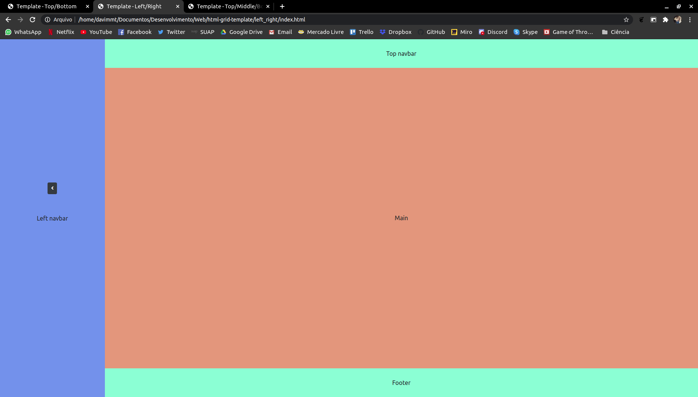
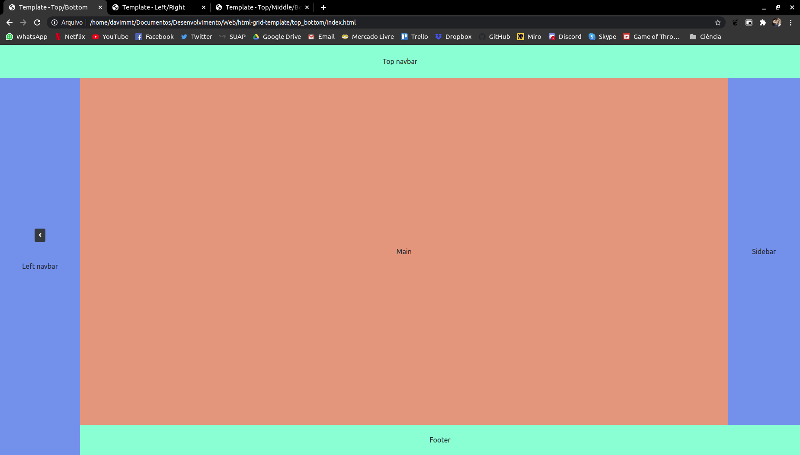
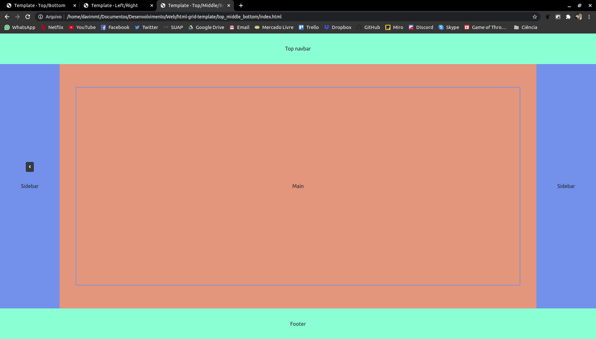

# html-grid-template

Sistema de grid básico para sistemas web, usado como template padrão:
- Left-right
  - Grid principal dividida em esquerda (navbar-left) e direita, sendo esta dividida em cima (navbar-top), meio (main-content) e baixo (footer).
   
   
- Top-bottom:
  - Grid principal dividida em cima (navbar-top) e baixo, sendo esta dividida em esquerda (navbar-left) e direita, sendo esta dividida em cima (main-content) e baixo (footer).
   
 
- Top-middle-bottom:
  - Grid principal dividida em cima (navbar-top), baixo (footer) e meio, sendo esta dividida em esquerda (navbar-left) meio (main-content) e direita (navbar-right, opcional).
   
